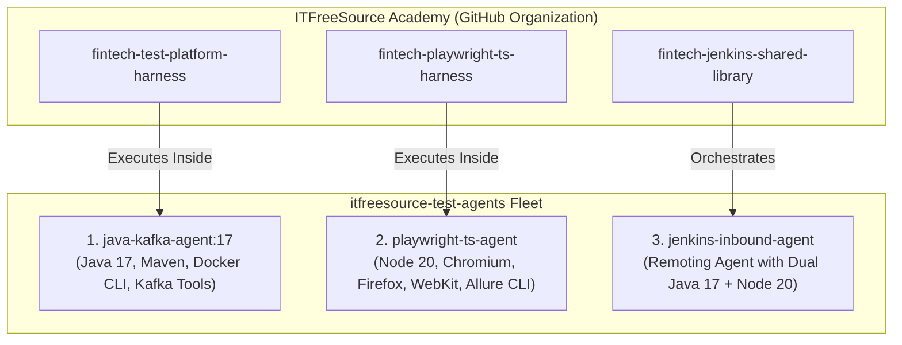

# ITFreeSource Academy &bull; Enterprise Test & CI/CD Agents

[](https://www.docker.com/)
[](https://github.com/itfreesource-academy/fintech-test-platform-harness)
[](https://github.com/itfreesource-academy/fintech-playwright-ts-harness)
[](https://github.com/itfreesource-academy/fintech-jenkins-shared-library)

A central repository containing **immutable, pre-baked containerized build agents and execution environments** for the **[ITFreeSource Academy](https://academy.itfreesource.com)** open-source ecosystem.

Designed and engineered by **[Vishal Prajapati](https://defendloop.io)** (*Senior Automation & Tools Development Engineer*) to ensure that anyone cloning our repositories can run tests hermetically with 100% capacity on any machine (local, VM, or Kubernetes pod) without manual environment setup.

---

## 🏛️ Agent Fleet Breakdown



---

## 📦 Agent Specifications

| Agent Name | Base Image | Pre-Installed Tools | Purpose |
| :--- | :--- | :--- | :--- |
| **`java-kafka-agent`** | `eclipse-temurin:17-jdk-jammy` | Java 17 LTS, Maven 3.9.6, Docker CLI, `jq`, `netcat` | Executes WireMock, REST Assured, and Kafka asynchronous event tests. |
| **`playwright-ts-agent`** | `mcr.microsoft.com/playwright:v1.43.0-jammy` | Node.js 20 LTS, Chromium, Firefox, WebKit, Allure CLI | Executes cross-browser Playwright E2E suites with full trace capturing. |
| **`jenkins-inbound-agent`** | `jenkins/inbound-agent:latest-jdk17` | Java 17, Node.js 20, Maven, Docker CLI | Full-capacity Jenkins Remoting Agent connected to Jenkins Controller. |

---

## 🚀 Quickstart: Building All Agents

Build the complete agent fleet locally with one command:

```bash
docker compose -f docker-compose.agents.yml build
```

---

## 🛠️ Executing Tests Using the Agents

### Run Java & Kafka Tests Inside the Container Agent:
```powershell
# Windows PowerShell:
.\scripts\run-in-java-agent.ps1 -TargetRepoPath "..\fintech-test-platform-harness"

# Linux / Mac:
docker run --rm -v "${PWD}/../fintech-test-platform-harness:/workspace" -w /workspace eclipse-temurin:17-jdk-jammy bash -c "./mvnw clean test"
```

### Run Playwright E2E Tests Inside the Container Agent:
```powershell
# Windows PowerShell:
.\scripts\run-in-playwright-agent.ps1 -TargetRepoPath "..\fintech-playwright-ts-harness"

# Linux / Mac:
docker run --rm -v "${PWD}/../fintech-playwright-ts-harness:/workspace" -w /workspace mcr.microsoft.com/playwright:v1.43.0-jammy bash -c "npm ci && npx playwright test --project=chromium"
```

---

## 👤 Author
* **Vishal Prajapati** — *Senior Associate: Test Automation & Tools Development Engineer*
* **Portfolio:** [defendloop.io](https://defendloop.io)
* **LinkedIn:** [linkedin.com/in/vishalprajapati2k25](https://www.linkedin.com/in/vishalprajapati2k25)
* **Organization:** Founder of [ITFreeSource Academy](https://academy.itfreesource.com)
